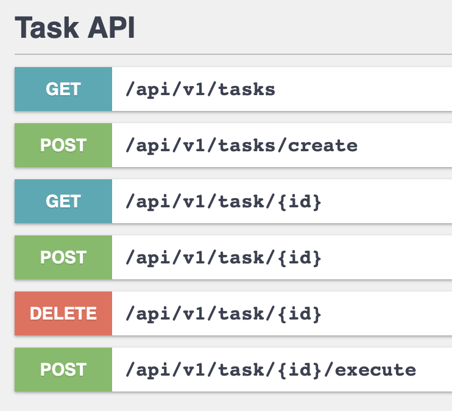

# RESTful API for task manager, Symfony 6 framework and MySQL database.

1. symfony serve
2. run docke-compose.yml

3. create a user:
curl -XPOST -H 'Content-Type: application/json' http://127.0.0.1:8000/api/v1/auth/signUp --data '{"firstName": "test", "lastName": "tester", "email": "test@test.com", "password": "testtest", "confirmPassword": "testtest"}'

4. login:
curl -XPOST "http://127.0.0.1:8000/api/v1/auth/login" -H "Content-Type: application/json" --data '{"username": "test@test.com", "password": "testtest"}'

5. curl "http://localhost:8000/api/v1/tasks" -H 'Authorization: Bearer token

